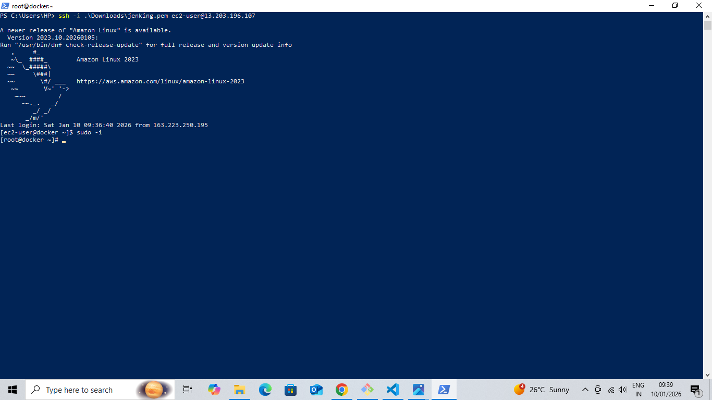
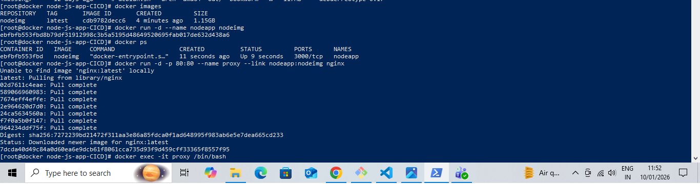
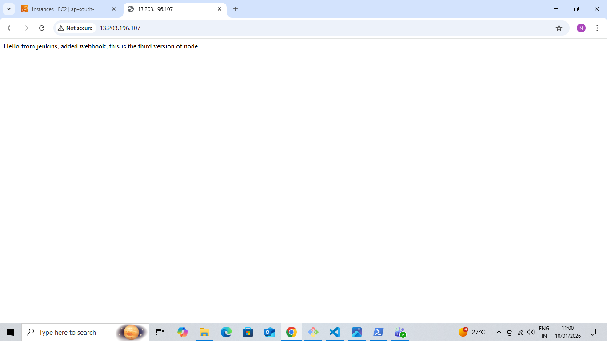
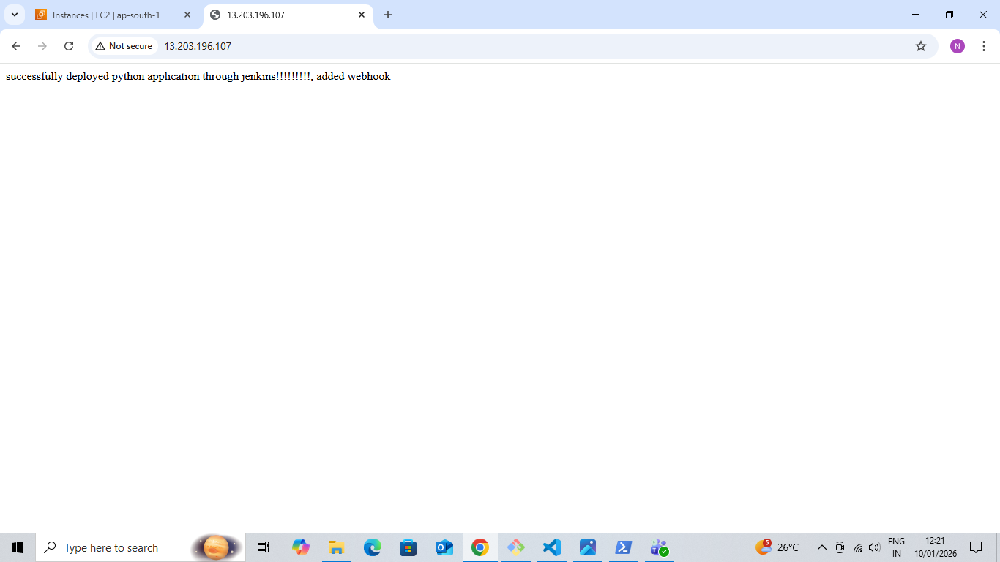

### Dockerized-Node.js-Python-Application-Deployment-with-Nginx-Proxy

### Project Description 

This project demonstrates how to deploy multiple backend services using Docker on a single AWS EC2 instance and expose them through an Nginx reverse proxy.

### The goal is to understand :

- Containerization of applications

- Reverse proxy routing

- Microservice-style architecture

- Real-world deployment without CI/CD tools

### Tech Stack :

- AWS EC2 – Cloud virtual server

- Docker – Container platform

- Nginx – Reverse proxy server

- Node.js – Backend service

- Python (Flask) – Backend service

- Git & GitHub – Version control

### Architecture :

### Implementation Steps :

### 1️⃣ EC2 Instance Setup

- Launch Amazon Linux EC2

- Connect via SSH

- Install Docker & start service

### 2️⃣ Node.js Application Dockerization

### Dockerfile

    FROM node
    WORKDIR /nodeapp
    COPY . .
    RUN npm install
    EXPOSE 3000
    CMD ["node", "app.js"]

### Build image:

docker build -t nodeapp ./node-app

### Run container:

docker run -d --name nodeapp nodeapp

### 3️⃣ Python Flask Application Dockerization

Dockerfile

    FROM python:3.8-alpine
    WORKDIR /pythonapp
    COPY . .
    RUN pip install -r requirements.txt
    EXPOSE 5000
    CMD ["python", "app.py"]

### Build image:

docker build -t pythonapp ./pythonapp

### Run container:

docker run -d --name pythonapp pythonapp

### 4️⃣ Nginx Reverse Proxy Configuration

      server {
    listen 80;

    location / {
        proxy_pass http://nodeapp:3000;
    }

    location /python {
        proxy_pass http://pythonapp:5000;
    }
}

### Run Nginx:

    docker run -d -p 80:80 \
    --name nginx-proxy \
    --link nodeapp \
    --link pythonapp \
    nginx

### 5 . Access Application

Open browser: http://<EC2-Public-IP>

- Node.js app at /node

- Python app at /python

### Key Highlights :

- Two backend services on a single server

- Docker-based microservices

- Nginx reverse proxy routing

- No external CI/CD used

- Beginner-friendly & industry-relevant

### Learning Outcomes :

- Docker image creation & container networking

- Nginx reverse proxy fundamentals

- AWS EC2 deployment

- Real-world microservice workflow

- Documentation with screenshots

### Conclusion : 

This project showcases a practical Docker deployment of multiple backend services behind an Nginx reverse proxy. It demonstrates how containerized applications can be efficiently deployed and managed on a single EC2 instance using industry-standard tools.

### Author :

####  Sonali Ghuge

GitHub:
https://github.com/iamSonaliGhuge

 LinkedIn:
 https://tinyurl.com/sonalighuge

